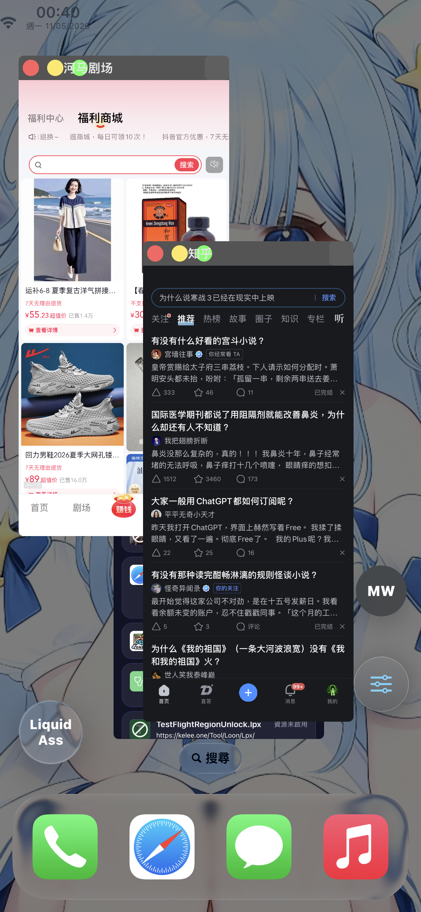

# MilkyWayReborn
A multitasking tweak that allows you to use multiple apps on screen at once.

This fork/branch adds support for a Coruna-style dylib injection workflow. It has been tested on iOS 16.7.2.

Original repository: https://github.com/34306/MilkyWayReborn

# Preview

The glass effect shown in the preview is implemented with LiquidAss. If anyone is interested, I can also provide a Coruna-style dylib build of LiquidAss.

# Credit
- Original MilkyWay2 tweak by akusio
- The fix on iOS 14 for references by brendonjkding
- with claude code and ida stuff
